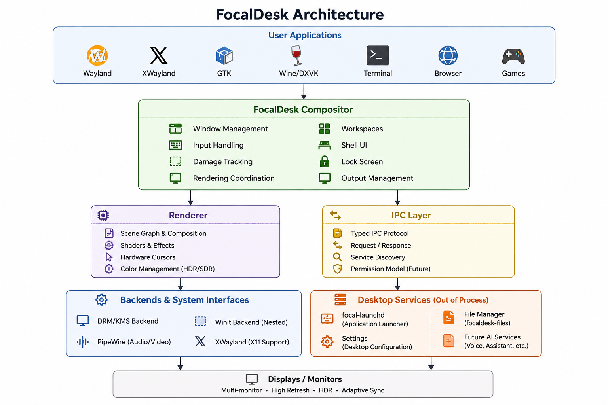

# FocalDesk

[](https://github.com/sjweiler/focaldesk/actions/workflows/ci.yml)
[](https://github.com/sjweiler/focaldesk/actions/workflows/codeql.yml)
[](LICENSE)


## Overview

FocalDesk is an experimental Wayland desktop environment built around a custom
Rust compositor and a cohesive system-experience layer. It is alpha software:
use it for development and testing, not as the only session protecting important
work.

The long-term direction is a fast, keyboard-friendly, retro-futuristic desktop
with structured workspaces, clear system feedback, and permissioned automation.
See the [project vision](docs/vision.md), [architecture](docs/architecture.md),
and [roadmap](ROADMAP.md) for the intended direction.

## Features

- Custom Wayland compositor with direct DRM/KMS and nested winit backends.
- Keyboard-oriented workspaces and multi-monitor window management.
- XWayland support for X11 applications, including tested Wine/DXVK workflows.
- OpenGL ES rendering with shell effects, damage tracking, and experimental HDR
  and color-management paths.
- First-party launcher, Settings, file manager, login greeter, and AI Console.
- Versioned theme editor with semantic surface tokens, wide-gamut/HDR paint
  intent, live compositor preview, wallpaper processing, and portable theme
  packages ([details](docs/theme-editor.md)).
- PipeWire and portal integration for experimental screen capture.
- Separate user services for launching, settings, notifications, power,
  dialogs, controls, speech, voice input, and permissioned automation.
- Encrypted credential broker with ACL-protected native IPC and Secret Service
  compatibility for libsecret applications.
- Typed local IPC and explicit permission checks for AI and automation actions.
- A read-heavy, capability-gated [MCP adapter](docs/mcp.md) over authoritative
  typed desktop IPC.

Features marked experimental are under active development and may be incomplete
or hardware-dependent. The status table below is the best summary of what works
today.

## Project Status

FocalDesk is developed and used by its project owner, but APIs, configuration,
and behavior may change without compatibility guarantees before a stable
release.

| Area | Status |
| --- | --- |
| Wayland compositor and desktop shell | Working, alpha |
| DRM/KMS and nested winit backends | Working, alpha |
| Workspaces and multi-monitor layout | Working, with ongoing edge-case work |
| XWayland application support | Working, alpha |
| PipeWire/portal screen capture | Experimental |
| HDR and color management | Experimental and hardware-dependent; HDR10 verified on Fedora 44 with NVIDIA 595, including Google Chrome ([details](docs/hdr.md#known-working-configuration)) |
| Settings, theme editor, file manager, launcher, and AI console | Usable prototypes; theme editor gradient rendering is not yet compositor-native |
| Local AI and automation services | Experimental and permission-gated |
| Precise Wayland subsurface damage tracking | Implemented, with safe fallbacks |

The table describes repository capabilities, not a compatibility guarantee for
every distribution, GPU, or application. See [Building FocalDesk](docs/building.md)
and [Troubleshooting](docs/troubleshooting.md) before testing it.

## Screenshots

### Desktop

The main desktop screenshot shows the compositor, shell chrome, workspace UI,
and native applications running together. The repository contains:

- Native Wayland compositor
- Desktop shell
- Display manager (focaldmd)
- Login greeter
- Session manager
- System services and IPC framework
- First-party desktop applications
- Integrated local AI framework


### Launcher

The native launcher provides application discovery and starts applications
through a dedicated launcher service rather than embedding process management
in the compositor.


### Settings

The settings prototype exposes appearance, display, input, privacy, power, and
service controls. Some panels are still incomplete or hardware-dependent.


### File Manager

The first-party file manager prototype provides common browsing, navigation,
search, sorting, and list/grid workflows.


### AI Console processing a query

The AI Console prototype connects to configured model providers through local
services. Provider availability and data handling depend on the user's selected
backend.


### Wine/DXVK rendering

This compatibility test shows World of Warcraft running through Wine/DXVK and
XWayland. It demonstrates a known-working setup, not compatibility with every
game, Wine version, or GPU driver.


### OBS (Open Broadcaster Software)

OBS Studio is shown capturing a FocalDesk output through PipeWire and the
Wayland portal path. Screen capture remains experimental.


## Architecture



Wayland and XWayland clients submit surfaces to the compositor, which owns
window and workspace state, input routing, shell behavior, rendering, and output
coordination. Desktop applications and background daemons stay outside the
rendering loop and communicate through local IPC, keeping process launching,
settings, permissions, and optional AI workflows separated from compositor
state.

The diagram is conceptual and includes elements marked as planned or future.
See the [architecture guide](docs/architecture.md) for the rendering and IPC
diagrams, current boundaries, and implementation notes.

## Technical Challenges

- **Compositor correctness:** surface lifecycles, focus, grabs, popups,
  subsurfaces, and XWayland behavior must remain correct across many toolkits.
- **Hardware diversity:** DRM/KMS, GPU drivers, multi-GPU systems, hotplug,
  mixed refresh rates, scaling, transforms, and hardware cursors vary widely.
- **Efficient rendering:** damage tracking must avoid unnecessary redraws while
  preserving correct composition; runtime metrics and compatibility tests are
  used to keep precise surface-tree tracking effective.
- **Color and capture:** HDR, wide-gamut color, ICC handling, SDR composition,
  PipeWire capture, and portal behavior require end-to-end validation.
- **System boundaries:** local IPC, service privileges, socket ownership, and
  permission records must stay auditable without blocking the desktop loop.
- **Safe iteration:** an alpha compositor needs reliable nested testing,
  diagnostics, crash recovery, and installation paths that leave a working
  desktop available.

## Technologies Used

| Area | Technology |
| --- | --- |
| Core language and build | Rust, Cargo, `just` |
| Compositor and protocols | Smithay, Wayland, XWayland |
| Display and input | DRM/KMS, GBM/EGL, libinput, libseat, udev |
| Rendering and text | OpenGL ES, `glow`, `tiny-skia`, `cosmic-text`, `swash` |
| Desktop applications | GTK 4, libadwaita |
| Media and desktop integration | PipeWire, ALSA, xdg-desktop-portal, D-Bus/`zbus` |
| Services and data | systemd user services, Unix sockets, Serde, SQLite |
| Automation and voice | Lua (`mlua`), Vosk, eSpeak NG, optional Piper |

## Repository Layout

- `apps/focaldesk-desktop`: compositor executable
- `apps/focaldesk-cli`: command-line interface
- `apps/focaldesk-ai-console`: interface app for ai
- `apps/focaldesk-files`: file app prototype
- `apps/focaldesk-settings`: settings app prototype
- `apps/focaldesk-portal`: portal-related app code
- `services/`: background daemons and IPC services
- `crates/`: shared FocalDesk libraries
- `assets/`: bundled visual assets
- `docs/`: design notes and architecture material

## Build Instructions

FocalDesk is currently developed as a Rust workspace for Linux.

Install Rust from <https://rustup.rs/> and follow the Fedora or Ubuntu dependency
instructions in [docs/building.md](docs/building.md). Fedora is the primary
development environment; Ubuntu is continuously compile-checked in CI.

Clone and build the complete workspace:

```sh
git clone https://github.com/sjweiler/focaldesk.git
cd focaldesk
cargo build --workspace
```

For an optimized build:

```sh
cargo build --release --workspace
```

If you already have the repository and have `just` installed, the equivalent
development build is:

```sh
just build
```

The full [building guide](docs/building.md) lists Fedora and Ubuntu/Debian
packages, the native Vosk dependency, nested testing, DRM/KMS session
installation, and uninstall guidance.

## Development Checks

```sh
cargo fmt --all -- --check
cargo check --workspace
cargo clippy --workspace --all-targets
cargo test --workspace
./scripts/check-markdown-links.sh
```

## Run

To run the compositor nested inside an existing Wayland session:

```sh
cargo run -p focaldesk-desktop --no-default-features --features winit
```

The default `focaldesk-desktop` features target a direct DRM/KMS session. Do not
run that mode casually from an important graphical session; use the installed
Wayland session described below.

To make FocalDesk show up in GDM, install the compositor and Wayland session:

```sh
just install-desktop
just install-desktop-session
```

That recipe builds a release binary and installs it to
`/usr/local/bin/focaldesk-desktop` (same path as the Wayland session `Exec=`).
On NVIDIA systems that expose `s2idle`, it also selects that suspend mode to
avoid stale GPU contexts and dead scanout after firmware S3/deep resume. The
installer activates `s2idle` immediately and fails if the kernel does not
confirm it as the selected mode. This is a platform workaround, not a substitute
for compositor recovery: FocalDesk also pauses rendering and DRM commits,
waits for libseat to restore device ownership, resets connector and plane state,
reprobes DRM resources, invalidates GPU caches, and submits a fresh modeset.
Re-run `just install-desktop-session` after changing the session file.

To build and install the file manager prototype:

```sh
just install-files
```

That recipe builds a release binary and installs it to
`/usr/local/bin/focaldesk-files`.

To build and install the settings app:

```sh
just install-settings
```

That recipe builds a release binary and installs it to
`/usr/local/bin/focaldesk-settings`.

Because FocalDesk is alpha compositor/system software, run it from a safe
development session first. Avoid switching important work over to it until you
know the current state of your local build.

Create a redacted, bounded diagnostic archive after a crash or compatibility
problem with:

```sh
focaldesk-cli diagnostics
```

Review the archive before sharing it. See [Troubleshooting](docs/troubleshooting.md)
for included data, privacy behavior, output options, and crash-report locations.

## AI Service

The background server exposes AI chat over the local IPC socket used by
`focaldesk-cli ai ...`.

CLI chat does not connect to model providers directly. If the background
server is unavailable, the command fails explicitly so no request can bypass
the normal permission and audit path.

The socket path resolves from `FOCALDESK_AI_SOCKET` first, then
`$XDG_RUNTIME_DIR/focaldesk/focaldesk-ai.sock` inside a user session. The
service refuses to start without a user runtime directory instead of falling
back to the shared `/tmp` namespace.

AI IPC v2 adds request IDs and AI-specific payload limits inside the standard
FocalDesk transport envelope. During the migration window, the daemon accepts
legacy v1 bare payloads and mirrors their response format. New clients retry a
request once in legacy form only when an older daemon explicitly rejects the
v2 envelope before dispatch.

Protocol v2 also supports bounded streaming frames with started, delta,
completed, failed, and cancelled events. Ollama streams tokens natively;
providers without a streaming transport emit a compatible single delta. The
AI Console streams replies into the transcript and exposes a **Stop** button.
CLI users can opt in with:

```sh
focaldesk-cli ai chat --stream "Summarize my current task"
```

Closing a streaming client cancels provider work when the daemon detects the
disconnect, and an explicit cancellation request can stop a stream by its
request ID.

Provider calls use one 120-second deadline and at most three attempts.
FocalDesk retries only typed transient transport failures, HTTP 408/425/429,
timeouts, and HTTP 5xx responses, using capped exponential backoff with jitter.
Authentication errors, invalid requests, permission denials, cancellations,
protocol failures, and streams that already emitted output are never retried.
The Console Providers page reports health, latency, retries, failures,
cancellations, byte totals, and provider-reported token usage after refresh.

By default the AI service asks the compositor to show a native approval modal,
logs each request, and records the decision through the normal FocalDesk
logging pipeline. If the desktop socket is unavailable, it falls back to the
service terminal.

You can tighten or relax the permission gate with:

- `FOCALDESK_AI_PERMISSION=prompt` to ask via the compositor modal before each request
- `FOCALDESK_AI_PERMISSION=allow-session` to allow chat for the current session
- `FOCALDESK_AI_PERMISSION=allow-persistent` to persist the allow decision on disk across restarts
- `FOCALDESK_AI_PERMISSION=deny` to block AI chat

The AI Console can opt individual chats into contextual memory from its
Settings page. Memory storage and search use the same permission boundary as
chat because embedding may contact the configured Ollama-compatible endpoint.
Recalled entries can be permanently removed with the **Forget** action.
The Memory page also shows the active lifecycle policy and provides a
fresh-confirmation **Clear all AI memory** action.

AI memory uses schema version 2, expires new records after 90 days by default,
and retains at most 10,000 records. Expired and over-capacity records are
pruned on startup and during normal memory operations. The configured
retention window is reapplied from each record's original creation time when
the store opens. Existing schema-v1 records are migrated transactionally. A
database created by a newer unsupported schema is
rejected rather than modified. Configure the limits with:

- `FOCALDESK_MEMORY_RETENTION_DAYS`; set it to `0` to disable expiration.
- `FOCALDESK_MEMORY_MAX_ENTRIES`; set it to `0` for no entry-count limit.

Individual and bulk deletion always require fresh native approval; saved AI
chat permission does not authorize deleting stored memory.

The CLI can also run a bounded desktop agent:

```sh
focaldesk-cli ai agent "Which applications and workspaces are currently open?"
```

The planner may request at most four tool calls and must return a strict JSON
plan. Read-only tools execute through the audited MCP backend. A mutating tool
is stored without execution under a random plan ID that expires after two
minutes. Requesting approval opens a fresh native modal containing the exact
stored arguments; approval is one-shot and cannot be remembered:

```sh
focaldesk-cli ai confirm <plan-id>
# or discard it without opening a prompt
focaldesk-cli ai deny <plan-id>
```

The daemon removes a plan before prompting to prevent replay. Model-generated
confirmation fields are rejected and never count as user consent.

Provider and agent regressions are covered by deterministic tests. Provider
tests use loopback-only one-shot HTTP fixtures for the OpenAI, Anthropic,
Ollama, and vLLM wire contracts; they require no API credentials, internet
access, or locally installed model service. Agent integration tests use a
scripted provider and recorded tools to cover complete synthesis, bounded
results, invalid plans, failures, mutation proposals, denial, expiry, and
replay prevention.

## Systemd Services

FocalDesk uses `systemd --user` for its background daemons. That is the
supported install path for the current codebase.

For a local build, install and enable the full service set with:

```sh
just install-services
```

That installs and enables:

- `focaldesk-server`
- `focal-launchd`
- `focaldesk-powerd`
- `focaldesk-notificationsd`
- `focaldesk-updatesd`
- `focaldesk-dialogd`
- `focaldesk-controlsd`
- `focaldesk-settingsd`
- `focaldesk-automation`
- `focald-voice`
- `focald-speech`
- `focald-mic`

Each unit lives under `packaging/systemd/user/` and is copied to
`~/.config/systemd/user/` for a local install.

If you are packaging for Fedora, use:

```sh
just install-services-fedora
```

That uses the Fedora unit variants under `packaging/systemd/user/*-fedora.service`
and installs the binaries into `/usr/bin/`.

If you only want one service, the per-daemon `just install-*-service` recipes
still work.

### Text-to-speech backends

`focald-speech` uses eSpeak NG by default. It can instead synthesize with Piper
and send Piper's raw PCM stream directly to PipeWire. Create a user-service
drop-in directly:

```sh
mkdir -p ~/.config/systemd/user/focald-speech.service.d
$EDITOR ~/.config/systemd/user/focald-speech.service.d/override.conf
```

Add the following override with the path to a downloaded `.onnx` voice model
(the matching `.onnx.json` file must be alongside it):

```ini
[Service]
Environment=FOCALD_SPEECH_BACKEND=piper
Environment=FOCALD_SPEECH_PIPER_MODEL=/path/to/en_US-lessac-medium.onnx
# Set this when Piper is installed outside systemd's PATH.
Environment=FOCALD_SPEECH_PROGRAM=/absolute/path/to/piper
# Match the sample rate in the model's adjacent JSON configuration.
Environment=FOCALD_SPEECH_PIPER_SAMPLE_RATE=22050
```

Then run `systemctl --user daemon-reload` and restart the daemon with
`systemctl --user restart focald-speech.service`. Piper and `pw-play` must be
installed. `FOCALD_SPEECH_PLAYER` can override the player executable. Set
`FOCALD_SPEECH_BACKEND=espeak-ng` (or remove the override) to return to eSpeak
NG.

## Roadmap

Near-term work is focused on compositor stability, multi-monitor behavior,
XWayland and portal hardening, configuration consolidation, auditable AI and
automation permissions, repeatable alpha releases, and clearing the Clippy
warning backlog. Rendering priorities include damage-path profiling, expanded
HDR/color validation, and broader cursor, direct-scanout, and multi-GPU testing.

Longer-term goals include maturing the first-party desktop experience, versioned
IPC, narrower service privileges, better accessibility and recovery workflows,
permissioned local automation, and optional remote-desktop support. These are
directions rather than release promises; see the complete [project
roadmap](ROADMAP.md) for current priorities and release-readiness criteria.

## Contributing

FocalDesk is currently a solo-developed alpha project. Focused contributions,
reproducible bug reports, and design feedback may be welcome, but review times
are not guaranteed and large architectural changes should be discussed before
implementation. Read [CONTRIBUTING.md](CONTRIBUTING.md) for issue guidance,
development checks, coding expectations, and pull-request scope. Participation
is governed by the [Code of Conduct](CODE_OF_CONDUCT.md), and vulnerabilities
should follow the private process in [SECURITY.md](SECURITY.md).

## Documentation

- [Building and installation](docs/building.md)
- [Compatibility testing](docs/compatibility-testing.md)
- [Configuration and environment](docs/configuration.md)
- [Credential broker](docs/secrets.md)
- [Default keybindings](docs/keybindings.md)
- [Troubleshooting and logs](docs/troubleshooting.md)
- [Architecture](docs/architecture.md)
- [IPC design](docs/ipc.md)
- [Project roadmap](ROADMAP.md)
- [Contributing](CONTRIBUTING.md)
- [Security policy](SECURITY.md)

## License

FocalDesk is licensed under the MIT License. See [LICENSE](LICENSE).

Bundled third-party assets retain their own licenses, including the icon and font license files under `assets/`.
