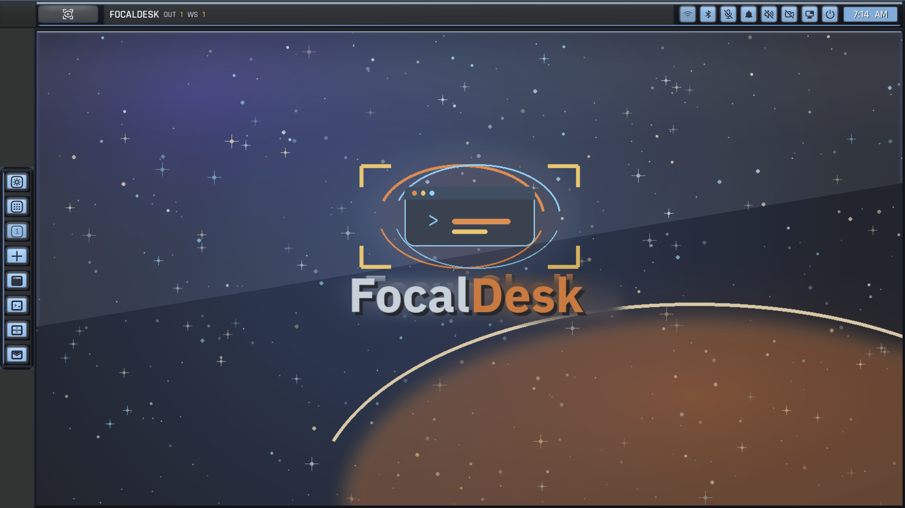
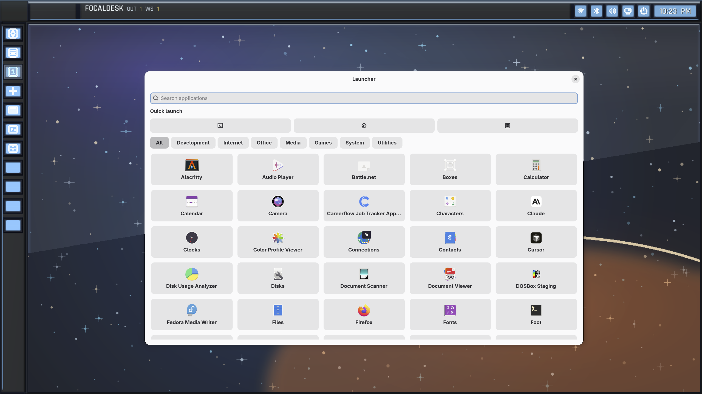
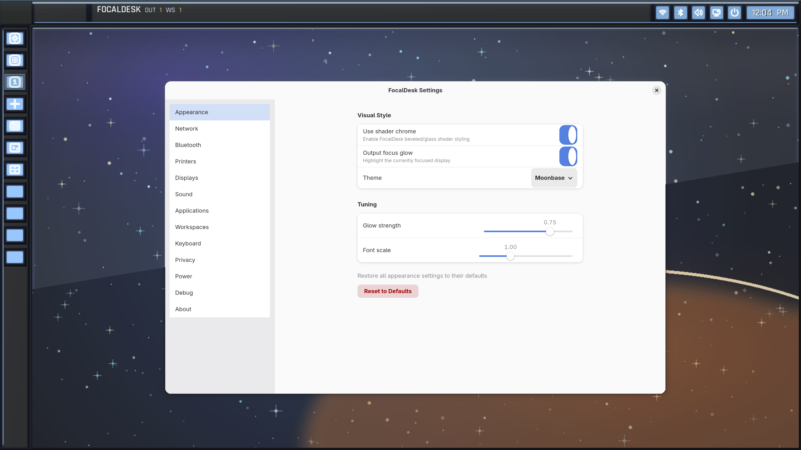
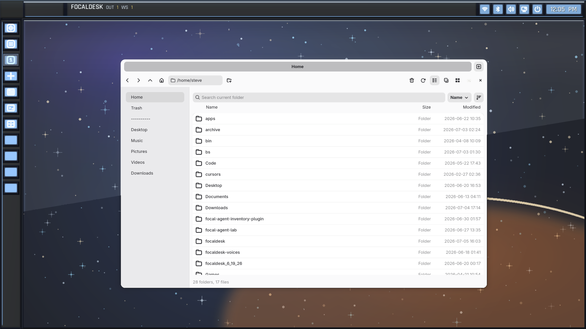
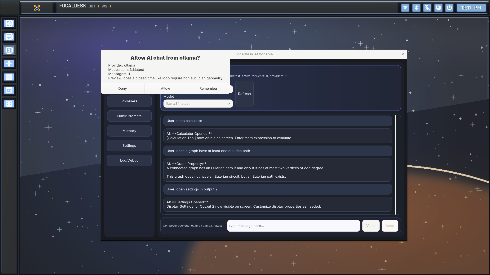
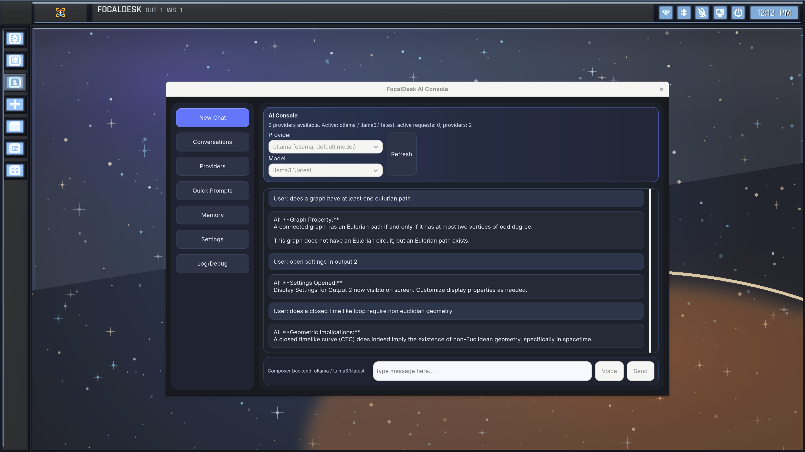
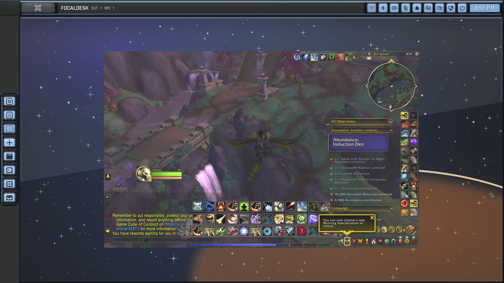
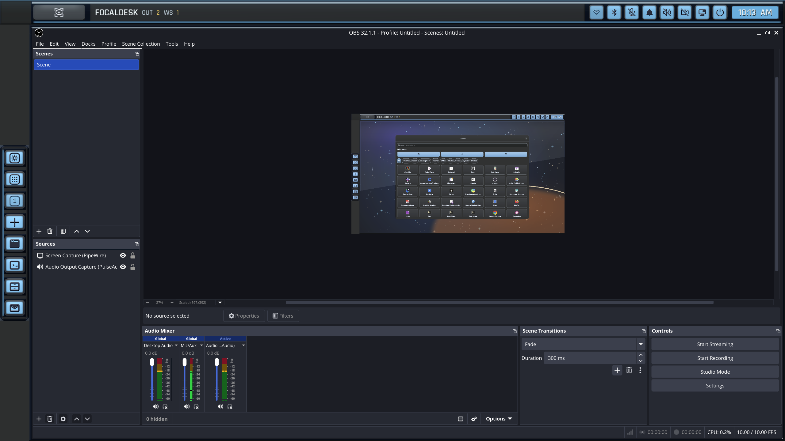

# FocalDesk


[](https://github.com/sjweiler/focaldesk/actions/workflows/ci.yml)
[](https://github.com/sjweiler/focaldesk/actions/workflows/codeql.yml)
[](LICENSE)


FocalDesk is an alpha desktop environment project built around a custom Wayland compositor and a cohesive system experience layer.

The long-term direction is a fast, keyboard-friendly, retro-futuristic desktop with structured workspaces, clear system feedback, and permissioned automation. See [docs/vision.md](docs/vision.md) for the broader project direction.

## Screenshots

## Desktop

FocalDesk Desktop Environment

FocalDesk is a modern Wayland desktop environment written in Rust, focused on performance, modularity, and AI integration.

The project now includes a complete desktop stack featuring:

- Native Wayland compositor
- Desktop shell
- Display manager (focaldmd)
- Login greeter
- Session manager
- System services and IPC framework
- First-party desktop applications
- Integrated local AI framework



## Launcher

Native Application Launcher

FocalDesk includes a lightweight native application launcher that provides quick access to desktop applications through a dedicated launcher service. The launcher communicates with the compositor through typed IPC, allowing application management without tightly coupling launcher logic to the rendering engine.



## Settings

Native Settings Application

FocalDesk includes a dedicated settings application for configuring desktop appearance, displays, networking, Bluetooth, audio, printers, workspaces, keyboard shortcuts, privacy, power management, and other system features. The application communicates with desktop services through a modular IPC architecture, providing a centralized configuration experience.



## File Manager

Native File Manager

FocalDesk includes a first-party file manager for browsing local storage with familiar desktop navigation. Features include sidebar navigation, address bar, search, list and grid views, file sorting, and integration with the FocalDesk desktop environment.



## AI Console asking for permission

AI Console & Permission Manager

Demonstrates FocalDesk's built-in AI framework with provider management, model selection, conversation tracking, and runtime permission prompts. AI services communicate through dedicated background daemons, allowing local LLM integration without embedding AI functionality directly into the compositor.



## AI Console processing query

Integrated AI Console

FocalDesk includes a native AI Console that connects to local language model providers through a modular service architecture. Users can select AI providers and models, manage conversations, maintain long-term memory, define reusable prompts, and interact with AI services without relying on cloud infrastructure.



## Wine/DXVK rendering

Compatibility Demonstration

FocalDesk successfully runs complex graphics applications through DXVK/Wine, including World of Warcraft. This validates compositor compatibility with Vulkan translation layers, XWayland integration, GPU acceleration, input handling, and high-performance rendering.



## OBS (Open Broadcaster Software)

OBS Studio (PipeWire Capture)

OBS Studio capturing the FocalDesk desktop through PipeWire, demonstrating native Wayland screen recording, portal integration, and compatibility with professional streaming and recording applications.



## Status

FocalDesk is alpha software.

It is stable enough for daily use by the project owner, but it is still early in
development. Expect incomplete features, breaking changes, rough edges, and
occasional compositor-level bugs. If you try it as a daily driver, be prepared
to debug Linux desktop, Wayland, graphics, and input issues.

## Repository Layout

- `apps/focaldesk-desktop`: compositor executable
- `apps/focaldesk-cli`: command-line interface
- `apps/focaldesk-ai-console`: interface app for ai
- `apps/focaldesk-files`: file app prototype
- `apps/focaldesk-settings`: settings app prototype
- `apps/focaldesk-portal`: portal-related app code
- `services/`: background daemons and IPC services
- `crates/`: shared FocalDesk libraries
- `assets/`: bundled visual assets
- `docs/`: design notes and architecture material

## Requirements

FocalDesk is currently developed as a Rust workspace for Linux.

Install Rust from <https://rustup.rs/>.

On Debian/Ubuntu-style systems, the CI environment installs:

```sh
sudo apt install -y \
  pkg-config \
  libwayland-dev \
  libxkbcommon-dev \
  libudev-dev \
  libinput-dev \
  libegl1-mesa-dev \
  libgles2-mesa-dev \
  libgbm-dev \
  libgtk-4-dev \
  libadwaita-1-dev
```

## Build

```sh
cargo build --workspace
```

Or, if you have `just` installed:

```sh
just build
```

## Check

```sh
cargo fmt --all -- --check
cargo clippy --workspace --all-targets -- -D warnings
cargo test --workspace
```

## Run

The main compositor binary is:

```sh
cargo run -p focaldesk-desktop
```

To make FocalDesk show up in GDM, install the compositor and Wayland session:

```sh
just install-desktop
just install-desktop-session
```

That recipe builds a release binary and installs it to
`/usr/local/bin/focaldesk-desktop` (same path as the Wayland session `Exec=`).
Re-run `just install-desktop-session` after changing the session file.

To build and install the file manager prototype:

```sh
just install-files
```

That recipe builds a release binary and installs it to
`/usr/local/bin/focaldesk-files`.

To build and install the settings app:

```sh
just install-settings
```

That recipe builds a release binary and installs it to
`/usr/local/bin/focaldesk-settings`.

Because FocalDesk is alpha compositor/system software, run it from a safe
development session first. Avoid switching important work over to it until you
know the current state of your local build.

## AI Service

The background server exposes AI chat over the local IPC socket used by
`focaldesk-cli ai ...`.

The socket path resolves from `FOCALDESK_AI_SOCKET` first, then
`$XDG_RUNTIME_DIR/focaldesk-ai.sock` inside a user session, and finally
`/tmp/focaldesk-ai.sock` when no runtime directory is available.

By default the AI service asks the compositor to show a native approval modal,
logs each request, and records the decision through the normal FocalDesk
logging pipeline. If the desktop socket is unavailable, it falls back to the
service terminal.

You can tighten or relax the permission gate with:

- `FOCALDESK_AI_PERMISSION=prompt` to ask via the compositor modal before each request
- `FOCALDESK_AI_PERMISSION=allow-session` to allow chat for the current session
- `FOCALDESK_AI_PERMISSION=allow-persistent` to persist the allow decision on disk across restarts
- `FOCALDESK_AI_PERMISSION=deny` to block AI chat

## Systemd Services

FocalDesk uses `systemd --user` for its background daemons. That is the
supported install path for the current codebase.

For a local build, install and enable the full service set with:

```sh
just install-services
```

That installs and enables:

- `focaldesk-server`
- `focal-launchd`
- `focaldesk-powerd`
- `focaldesk-notificationsd`
- `focaldesk-dialogd`
- `focaldesk-controlsd`
- `focaldesk-settingsd`

Each unit lives under `packaging/systemd/user/` and is copied to
`~/.config/systemd/user/` for a local install.

If you are packaging for Fedora, use:

```sh
just install-services-fedora
```

That uses the Fedora unit variants under `packaging/systemd/user/*-fedora.service`
and installs the binaries into `/usr/bin/`.

If you only want one service, the per-daemon `just install-*-service` recipes
still work.

## License

FocalDesk is licensed under the MIT License. See [LICENSE](LICENSE).

Bundled third-party assets retain their own licenses, including the icon and font license files under `assets/`.
