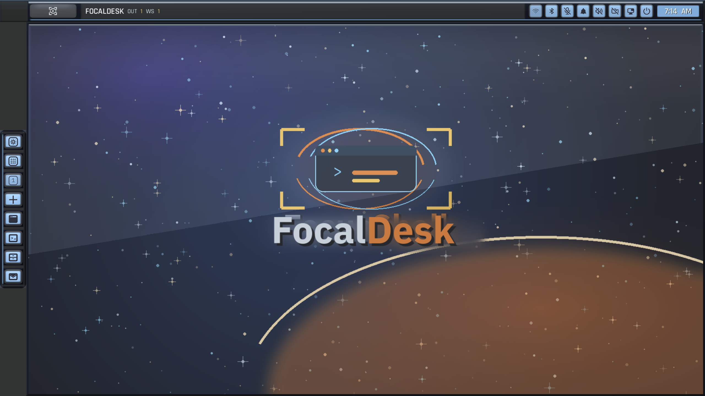
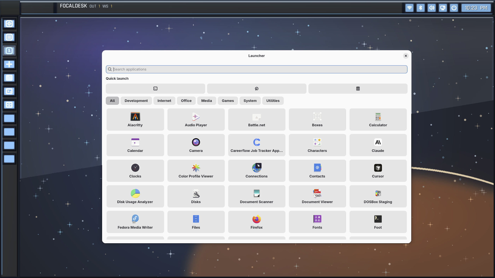
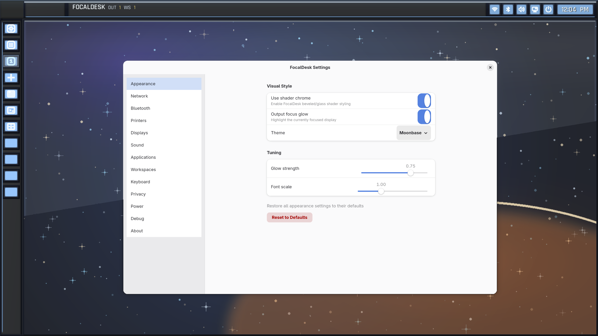
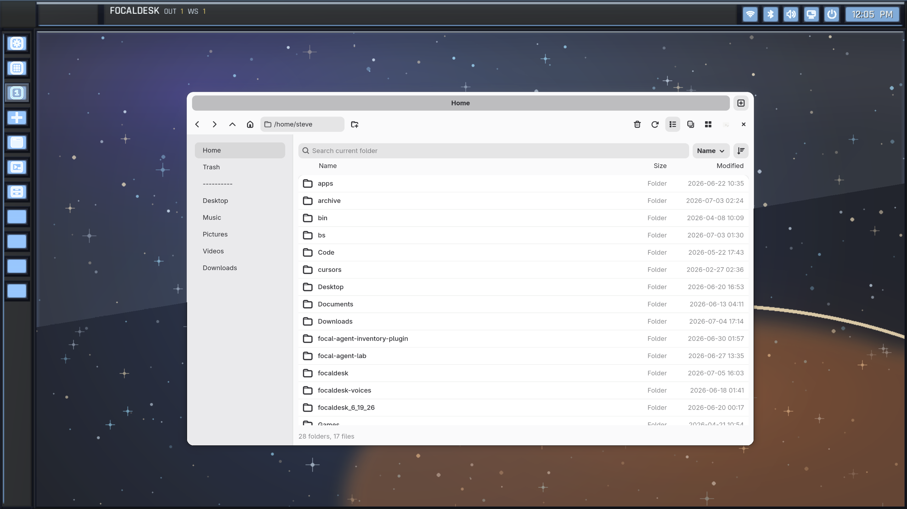
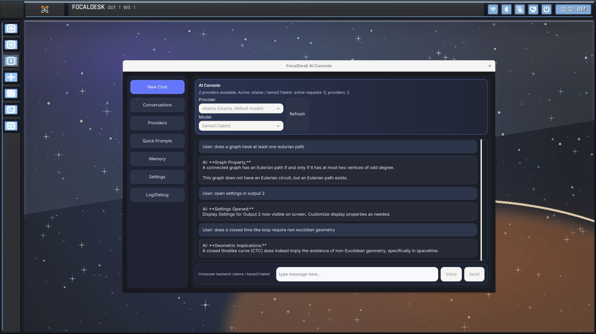
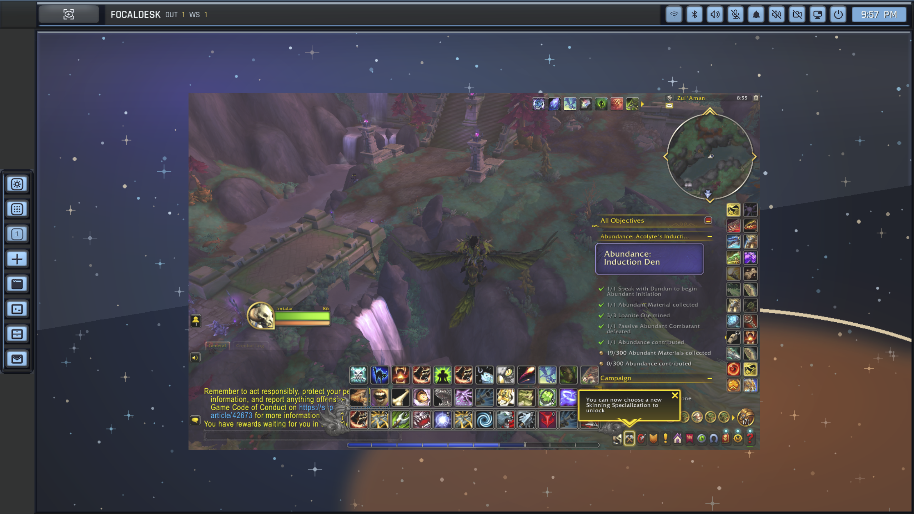
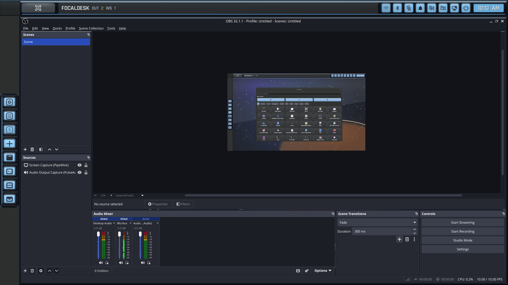
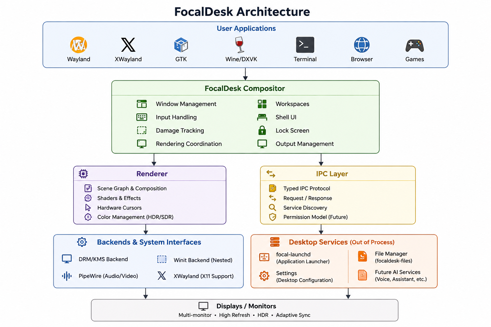

# FocalDesk

[](https://github.com/sjweiler/focaldesk/actions/workflows/ci.yml)
[](https://github.com/sjweiler/focaldesk/actions/workflows/codeql.yml)
[](LICENSE)


## Overview

FocalDesk is an experimental Wayland desktop environment built around a custom
Rust compositor and a cohesive system-experience layer. It is alpha software:
use it for development and testing, not as the only session protecting important
work.

The long-term direction is a fast, keyboard-friendly, retro-futuristic desktop
with structured workspaces, clear system feedback, and permissioned automation.
See the [project vision](docs/vision.md), [architecture](docs/architecture.md),
and [roadmap](ROADMAP.md) for the intended direction. Alpha limitations are
tracked in [Known Issues](docs/known-issues.md).

## Features

- Custom Wayland compositor with selectable GLES and raw-Ash Vulkan DRM/KMS
  renderers, plus nested winit and experimental nested wgpu/Vulkan backends.
- Keyboard-oriented workspaces and multi-monitor window management.
- XWayland support for X11 applications, including tested Wine/DXVK workflows.
- GLES and Vulkan rendering with damage tracking and experimental HDR and color
  management. Raw Ash Vulkan is the project owner's primary daily-tested path;
  GLES remains the packaged compatibility and recovery default.
- First-party launcher, Settings, file manager, login greeter, and AI Console
  with a permissioned Desktop Agent and external coding-agent launcher.
- Versioned theme editor with semantic surface tokens, wide-gamut/HDR paint
  intent, live compositor preview, wallpaper processing, and portable theme
  packages ([details](docs/theme-editor.md)).
- PipeWire and portal integration for experimental screen capture.
- Experimental, view-only RDP service with TLS, short-lived credentials, and a
  loopback-only listener ([details](docs/remote-desktop.md)).
- Separate user services for launching, settings, notifications, power,
  dialogs, controls, speech, voice input, and permissioned automation.
- Encrypted credential broker with ACL-protected native IPC and Secret Service
  compatibility for libsecret applications.
- Typed local IPC and explicit permission checks for AI and automation actions.
- A read-heavy, capability-gated [MCP adapter](docs/mcp.md) over authoritative
  typed desktop IPC.

Features marked experimental are under active development and may be incomplete
or hardware-dependent. The status table below is the best summary of what works
today.

## Project Status

FocalDesk is developed and used by its project owner, but APIs, configuration,
and behavior may change without compatibility guarantees before a stable
release.

| Area | Status |
| --- | --- |
| Wayland compositor and desktop shell | Working, alpha |
| Wayland text input and input methods | text-input-v3 implemented; input-method-v2 restricted to configured IME executables |
| DRM/KMS and nested winit backends | Working, alpha |
| Workspaces and multi-monitor layout | Working, with ongoing edge-case work |
| XWayland application support | Working, alpha |
| PipeWire/portal screen capture | Experimental |
| Remote desktop | Experimental Phase 3: one output, one view-only RDP client, loopback/SSH-tunnel access only |
| HDR and color management | Experimental and hardware-dependent; HDR10 verified through both GLES and raw Ash Vulkan on Fedora 44 with NVIDIA 595. Raw Vulkan has also been visually validated with HDR images and video, visually correct SDR-in-HDR composition, a TCL HDR 1400 display stable at 165 Hz, and an ASUS VG32VQR DisplayHDR 400 display stable at up to 120 Hz. An automated ArgyllCMS measurement workflow is implemented, but the physical meter run is still pending ([validation status](docs/hdr.md#validation-status)) |
| Settings, theme editor, file manager, launcher, and AI console | Usable prototypes; theme editor gradients render compositor-side with up to eight stops |
| Local AI and automation services | Experimental and permission-gated |
| Precise Wayland subsurface damage tracking | Implemented, with safe fallbacks |

The table describes repository capabilities, not a compatibility guarantee for
every distribution, GPU, or application. See [Building FocalDesk](docs/building.md)
and [Troubleshooting](docs/troubleshooting.md) before testing it.

## Screenshots

### Desktop

The main desktop screenshot shows the compositor, shell chrome, workspace UI,
and native applications running together. The repository contains:

- Native Wayland compositor
- Desktop shell
- Display manager (focaldmd)
- Login greeter
- Session manager
- System services and IPC framework
- First-party desktop applications
- Integrated local AI framework



### Launcher

The native launcher provides application discovery and starts applications
through a dedicated launcher service rather than embedding process management
in the compositor.



### Settings

The settings prototype exposes appearance, display, input, privacy, power, and
service controls. Some panels are still incomplete or hardware-dependent.



### File Manager

The first-party file manager prototype provides common browsing, navigation,
search, sorting, and list/grid workflows.



### AI Console processing a query

The AI Console prototype connects to configured model providers through local
services. Provider availability and data handling depend on the user's selected
backend.



### Wine/DXVK rendering

This compatibility test shows World of Warcraft running through Wine/DXVK and
XWayland. It demonstrates a known-working setup, not compatibility with every
game, Wine version, or GPU driver.



### OBS (Open Broadcaster Software)

OBS Studio is shown capturing a FocalDesk output through PipeWire and the
Wayland portal path. Screen capture remains experimental.



## Architecture



Wayland and XWayland clients submit surfaces to the compositor, which owns
window and workspace state, input routing, shell behavior, rendering, and output
coordination. Desktop applications and background daemons stay outside the
rendering loop and communicate through local IPC, keeping process launching,
settings, permissions, and optional AI workflows separated from compositor
state.

The diagram is conceptual and includes elements marked as planned or future.
See the [architecture guide](docs/architecture.md) for the rendering and IPC
diagrams, current boundaries, and implementation notes.

## Technical Challenges

- **Compositor correctness:** surface lifecycles, focus, grabs, popups,
  subsurfaces, and XWayland behavior must remain correct across many toolkits.
- **Hardware diversity:** DRM/KMS, GPU drivers, multi-GPU systems, hotplug,
  mixed refresh rates, scaling, transforms, and hardware cursors vary widely.
- **Efficient rendering:** damage tracking must avoid unnecessary redraws while
  preserving correct composition; runtime metrics and compatibility tests are
  used to keep precise surface-tree tracking effective.
- **Color and capture:** HDR, wide-gamut color, ICC handling, SDR composition,
  PipeWire capture, and portal behavior require end-to-end validation.
- **System boundaries:** local IPC, service privileges, socket ownership, and
  permission records must stay auditable without blocking the desktop loop.
- **Safe iteration:** an alpha compositor needs reliable nested testing,
  diagnostics, crash recovery, and installation paths that leave a working
  desktop available.

## Technologies Used

| Area | Technology |
| --- | --- |
| Core language and build | Rust, Cargo, `just` |
| Compositor and protocols | Smithay, Wayland, XWayland |
| Display and input | DRM/KMS, GBM/EGL, libinput, libseat, udev |
| Rendering and text | OpenGL ES, `glow`, `tiny-skia`, `cosmic-text`, `swash` |
| Desktop applications | GTK 4, libadwaita |
| Media and desktop integration | PipeWire, ALSA, xdg-desktop-portal, D-Bus/`zbus` |
| Services and data | systemd user services, Unix sockets, Serde, SQLite |
| Automation and voice | Lua (`mlua`), Vosk, eSpeak NG, optional Piper |

## Repository Layout

- `apps/focaldesk-desktop`: compositor executable
- `apps/focaldesk-cli`: command-line interface
- `apps/focaldesk-ai-console`: interface app for ai
- `apps/focaldesk-files`: file app prototype
- `apps/focaldesk-settings`: settings app prototype
- `apps/focaldesk-portal`: portal-related app code
- `services/focaldesk-remoted`: experimental view-only RDP service
- `services/`: other background daemons and IPC services
- `crates/`: shared FocalDesk libraries
- `assets/`: bundled visual assets
- `docs/`: design notes and architecture material

## Build Instructions

FocalDesk is currently developed as a Rust workspace for Linux.

Install Rust from <https://rustup.rs/> and follow the Fedora or Ubuntu dependency
instructions in [docs/building.md](docs/building.md). Fedora is the primary
development environment; Ubuntu is continuously compile-checked in CI.

Clone and build the complete workspace:

```sh
git clone https://github.com/sjweiler/focaldesk.git
cd focaldesk
cargo build --workspace
```

For an optimized build:

```sh
cargo build --release --workspace
```

If you already have the repository and have `just` installed, the equivalent
development build is:

```sh
just build
```

The full [building guide](docs/building.md) lists Fedora and Ubuntu/Debian
packages, the native Vosk dependency, nested testing, DRM/KMS session
installation, and uninstall guidance.

## Development Checks

```sh
cargo fmt --all -- --check
cargo check --workspace
cargo clippy --workspace --all-targets
cargo test --workspace
./scripts/check-markdown-links.sh
```

## Run

To run the compositor nested inside an existing Wayland session:

```sh
cargo run -p focaldesk-desktop --no-default-features --features winit
```

The default `focaldesk-desktop` features target a direct DRM/KMS session. Do not
run that mode casually from an important graphical session; use the installed
Wayland session described below.

To make FocalDesk show up in GDM, install the compositor and Wayland session:

```sh
just install-desktop
just install-desktop-session
```

That recipe builds and installs the compositor to
`/usr/local/bin/focaldesk-desktop` (the Wayland session `Exec=`), and installs
the matching `/usr/local/bin/focaldesk-settings` so display configuration
schema changes cannot be lost by an older Settings application.
FocalDesk leaves the platform sleep mode unchanged, including firmware-backed
`deep` sleep. It pauses rendering and DRM commits, waits for libseat to restore
device ownership, resets connector and plane state, reprobes DRM resources,
invalidates GPU caches, and submits a fresh modeset. NVIDIA renderers use
implicit KMS synchronization so the driver's plane-fence state cannot prevent
resume or a later logout/login modeset. Once the first recovered page flip
completes, FocalDesk restarts its GPU-rendered rail and dock to replace any
partial client-side caches. The installer also removes the legacy
FocalDesk-owned NVIDIA `s2idle` override if an older installation left it behind.
Re-run `just install-desktop-session` after changing the session file.

To build and install the file manager prototype:

```sh
just install-files
```

That recipe builds a release binary and installs it to
`/usr/local/bin/focaldesk-files`.

To build and install the settings app:

```sh
just install-settings
```

That recipe builds a release binary and installs it to
`/usr/local/bin/focaldesk-settings`.

Because FocalDesk is alpha compositor/system software, run it from a safe
development session first. Avoid switching important work over to it until you
know the current state of your local build.

Create a redacted, bounded diagnostic archive after a crash or compatibility
problem with:

```sh
focaldesk-cli diagnostics
```

Review the archive before sharing it. See [Troubleshooting](docs/troubleshooting.md)
for included data, privacy behavior, output options, and crash-report locations.

## AI Service

The background server exposes AI chat over the local IPC socket used by
`focaldesk-cli ai ...`.

CLI chat does not connect to model providers directly. If the background
server is unavailable, the command fails explicitly so no request can bypass
the normal permission and audit path.

The socket path resolves from `FOCALDESK_AI_SOCKET` first, then
`$XDG_RUNTIME_DIR/focaldesk/focaldesk-ai.sock` inside a user session. The
service refuses to start without a user runtime directory instead of falling
back to the shared `/tmp` namespace.

AI IPC v2 adds request IDs and AI-specific payload limits inside the standard
FocalDesk transport envelope. During the migration window, the daemon accepts
legacy v1 bare payloads and mirrors their response format. New clients retry a
request once in legacy form only when an older daemon explicitly rejects the
v2 envelope before dispatch.

Protocol v2 also supports bounded streaming frames with started, delta,
completed, failed, and cancelled events. Ollama streams tokens natively;
providers without a streaming transport emit a compatible single delta. The
AI Console streams replies into the transcript and exposes a **Stop** button.
CLI users can opt in with:

```sh
focaldesk-cli ai chat --stream "Summarize my current task"
```

Closing a streaming client cancels provider work when the daemon detects the
disconnect, and an explicit cancellation request can stop a stream by its
request ID.

Provider calls use one 120-second deadline and at most three attempts.
FocalDesk retries only typed transient transport failures, HTTP 408/425/429,
timeouts, and HTTP 5xx responses, using capped exponential backoff with jitter.
Authentication errors, invalid requests, permission denials, cancellations,
protocol failures, and streams that already emitted output are never retried.
The Console Providers page reports health, latency, retries, failures,
cancellations, byte totals, and provider-reported token usage after refresh.

By default the AI service asks the compositor to show a native approval modal,
logs each request, and records the decision through the normal FocalDesk
logging pipeline. If the desktop socket is unavailable, it falls back to the
service terminal.

You can tighten or relax the permission gate with:

- `FOCALDESK_AI_PERMISSION=prompt` to ask via the compositor modal before each request
- `FOCALDESK_AI_PERMISSION=allow-session` to allow chat for the current session
- `FOCALDESK_AI_PERMISSION=allow-persistent` to persist the allow decision on disk across restarts
- `FOCALDESK_AI_PERMISSION=deny` to block AI chat

The AI Console can opt individual chats into contextual memory from its
Settings page. Memory storage and search use the same permission boundary as
chat because embedding may contact the configured Ollama-compatible endpoint.
Recalled entries can be permanently removed with the **Forget** action.
The Memory page also shows the active lifecycle policy and provides a
fresh-confirmation **Clear all AI memory** action.

AI memory uses schema version 4, expires new records after 90 days by default,
and retains at most 10,000 records. Expired and over-capacity records are
pruned on startup and during normal memory operations. The configured
retention window is reapplied from each record's original creation time when
the store opens. Existing schema-v1 through schema-v3 records are migrated
transactionally. A
database created by a newer unsupported schema is
rejected rather than modified. Configure the limits with:

- `FOCALDESK_MEMORY_RETENTION_DAYS`; set it to `0` to disable expiration.
- `FOCALDESK_MEMORY_MAX_ENTRIES`; set it to `0` for no entry-count limit.

Hybrid memory search combines semantic candidates from the private
`focal-vector.service` sidecar with SQLite FTS5 keyword candidates, then uses
reciprocal-rank fusion and a deterministic token-overlap reranker. SQLite
remains authoritative for memory text and retains embedding
bytes so a missing Focal Vector collection can be rebuilt. The service uses
`$XDG_RUNTIME_DIR/focaldesk/focal-vector.sock` and stores its rebuildable index
under `$XDG_DATA_HOME/focaldesk/vector` (or the corresponding default data
directory). For development or rollback, set
`FOCALDESK_MEMORY_BACKEND=sqlite-vec`. Override the collection name with
`FOCALDESK_MEMORY_COLLECTION`; collections must use the configured embedding
dimension and cosine metric.

Individual and bulk deletion always require fresh native approval; saved AI
chat permission does not authorize deleting stored memory.

The CLI and AI Console **Indexed Sources** page can index bounded UTF-8 text,
Markdown, source, PDF, and DOCX files into the same retrieval collection, then
opt a chat into grounded retrieval:

```sh
focaldesk-cli ai ingest ./notes/project.md
focaldesk-cli ai ingest ./notes --recursive
focaldesk-cli ai chat --memory "What did the project notes say about recovery?"
```

Documents are capped at 8 MiB, chunked with overlap, and stored with their
canonical source path. Re-indexing a changed source replaces its catalog entry
and retires its old chunks; unchanged content is skipped. Sources can be
listed, refreshed, or removed without deleting the original file:

Directory ingestion accepts supported document and source-code files, skips
hidden entries and symbolic links, and only descends into subdirectories when
`--recursive` is supplied. The AI Console provides an **Add Folder** picker
that performs a recursive import and reports indexed, unchanged, skipped, and
failed file counts.

```sh
focaldesk-cli ai sources
focaldesk-cli ai ingest ./notes/project.md
focaldesk-cli ai remove-source /canonical/path/to/project.md
```

Retrieved chunks are marked as untrusted evidence in
the model prompt and returned as structured citations; the CLI prints the
sources and distances after the answer. File ingestion is explicit and passes
through the normal AI permission gate.

Retrieval quality can be measured against a JSON array of query/source pairs:

```json
[
  {"query":"How is recovery handled?","expected_source":"/canonical/path/to/project.md"}
]
```

Run `focaldesk-cli ai eval cases.json --top-k 5` to report recall@k and mean
reciprocal rank using the same hybrid retrieval path as chat.

The CLI can also run a bounded desktop agent:

```sh
focaldesk-cli ai agent "Which applications and workspaces are currently open?"
```

The planner may request at most four tool calls and must return a strict JSON
plan. Read-only tools execute through the audited MCP backend. A mutating tool
is stored without execution under a random plan ID that expires after two
minutes. Requesting approval opens a fresh native modal containing the exact
stored arguments; approval is one-shot and cannot be remembered:

```sh
focaldesk-cli ai confirm <plan-id>
# or discard it without opening a prompt
focaldesk-cli ai deny <plan-id>
```

The daemon removes a plan before prompting to prevent replay. Model-generated
confirmation fields are rejected and never count as user consent.

Custom profiles can be built with the validation-backed Rust `AgentBuilder` or
installed as declarative `agent.toml` package directories. See the
[FocalDesk Agent SDK](docs/agent-sdk.md) for resource budgets, deterministic
test utilities, durable runs, package rules, and permissioned schedules or
desktop/voice/hotkey/IPC triggers.
The AI Console's Agent Studio can author, hot-reload, disable, simulate, and
roll back these packages, enforce daily token/estimated-cost ceilings, inspect
live health and durable history, and suspend all background triggers in an emergency.
Its installed-agent view shows each profile's tools, limits, triggers, usage,
and declared capability scopes, with controls to enable, disable, or roll back
the selected agent. See the [Agent Studio guide](docs/agent-studio.md).

The AIOS Supervisor coordinates bounded multi-agent DAGs with parallel ready
nodes, typed artifact handoffs, shared deadlines/token ceilings, durable safe
checkpoints, and pause/resume/cancel/retry controls. Its built-in workflows
cover morning briefing, workspace troubleshooting, and meeting preparation.

The capability kernel gives each managed run an expiring, revocable lease over
tools and scoped filesystem, network, application, workspace, service, and
opaque-secret-handle resources. Workflow authority is an intersection, and
Agent Studio provides previews, a live lease map, and immediate revocation.

The AI Console's **Ambient Voice** workspace adds explicitly started, offline
Vosk listening behind the default wake phrase “hello focaldesk.” Raw audio is
held only in a bounded RAM buffer and discarded on stop; transcript retention
is off by default and remains session-only when enabled. A visible microphone
state, immediate kill switch, and barge-in cancellation remain local to the
Console. Recognized requests can start a named workflow (`run workflow …`),
start a named agent (`ask agent … to …`), or enter normal chat, but they cannot
approve mutations. See [Ambient Voice](docs/voice.md) for the exact behavior
and privacy boundaries.

The **Context Fabric** workspace can publish only selected typed desktop
metadata or the active conversation as bounded, expiring envelopes. Each item
has provenance and sensitivity metadata, and an agent receives it only through
an explicit live grant intersected with its manifest's `context_kinds`
capability. The inspector can revoke grants or clear envelopes immediately.
Natural requests such as “summarize this,” “prepare for my next meeting,” and
“what is wrong here?” use deterministic, explainable routing before falling
back to ordinary chat. See [Context Fabric](docs/context-fabric.md).

The **Event Fabric** workspace is the consent boundary for proactive inputs.
Desktop, calendar, notification, service-health, and workflow sources begin
disabled and require an explicit supported-field allowlist, bounded retention,
and forwarding choice. Only a newly constructed redacted envelope enters the
256-item in-memory journal. Simulation, redacted replay, immediate clearing,
and an emergency disconnect are built in. See
[Event Fabric and Consent Center](docs/event-fabric.md).

The **Connector SDK and Trust Store** adds validated versioned producer
manifests, five disabled-by-default local connector identities, namespaced
opaque signing-key handles, signed event requests with freshness and replay
protection, persistent source consent, health reporting, explicit network
domain authority, and reversible updates. See
[Connector SDK and Trust Store](docs/connector-sdk.md).

The **Managed Connector Host** (`focald-connectors`) turns explicitly enabled
connector identities into supervised local producers. It includes minimized
desktop, service-health, notification, and opt-in ICS adapters, plus transient
systemd-sandboxed custom runtimes with resource limits, bounded backoff, and
quarantine. The Console can inspect, pause, poll, and recover the host; install
alone grants no source or network consent. See
[Managed Connector Host](docs/connector-host.md).

The **AIOS Mission Control** workspace correlates the redacted event timeline,
context provenance, routine suggestions, active agents and workflows,
capability leases, microphone/connector runtime state, budgets, and durable control audit. It supports
bounded search, live refresh, simulation-only event replay, scoped run
cancellation, and a restart-persistent emergency pause without exposing tool
arguments, results, context payloads, or raw failures. See
[AIOS Mission Control](docs/mission-control.md).

The **AIOS Scenario Lab** evaluates synthetic voice, connector, context,
routine, agent-plan, failure, restart, and minimized-trace fixtures in a pure
shadow runtime. Stable violation codes make safe and expected-denial scenarios
CI-testable, while reports guarantee zero provider calls, tool executions, and
live mutations. The Console includes an editor and minimized Mission Control
capture; `focaldesk-cli ai scenario` runs the same contract locally. See
[AIOS Scenario Lab](docs/scenario-lab.md).

The **AIOS Package Manager** installs signed, versioned `.fai` bundles for
agents, workflows, routines, and connectors. Explicit signer trust, authority
inspection, and passing Scenario Lab fixtures are mandatory before staging;
activation preserves separate consent for network access and background
execution. See [AIOS Package Manager](docs/package-manager.md).

The **AIOS Package Forge** supplies reproducible project scaffolding, protected
signer generation through `focald-secrets`, local Scenario Lab testing, signed
builds, verification, an offline dependency-aware catalog, CI guidance, and a
Console project editor. See [AIOS Package Forge](docs/package-forge.md).

The opt-in **Private AIOS Registry** adds authenticated publishing,
operator-signed catalogs, pinned catalog keys, approved package signers,
revocations, exact dependency lockfiles, verified quarantine downloads, and
audited administration. It never auto-downloads, auto-trusts, or auto-installs
packages. See [Private AIOS Registry](docs/private-aios-registry.md).

The **Attention** workspace evaluates bounded typed events against declarative
routines and publishes suggestions only. Built-ins cover morning briefing,
meeting preparation, and repeated service failure, with explainable matching,
UTC quiet hours, cooldowns, hourly limits, duplicate suppression, simulation,
and a global emergency pause. Starting the proposed agent or workflow requires
a separate explicit promotion and retains all normal capability, permission,
and native confirmation boundaries. See
[Attention and Routine Engine](docs/attention-routines.md).

Provider and agent regressions are covered by deterministic tests. Provider
tests use loopback-only one-shot HTTP fixtures for the OpenAI, Anthropic,
Ollama, and vLLM wire contracts; they require no API credentials, internet
access, or locally installed model service. Agent integration tests use a
scripted provider and recorded tools to cover complete synthesis, bounded
results, invalid plans, failures, mutation proposals, denial, expiry, and
replay prevention.

## Systemd Services

FocalDesk uses `systemd --user` for its background daemons. That is the
supported install path for the current codebase.

For a local build, install and enable the full service set with:

```sh
just install-services
```

That installs and enables the core services:

- `focaldesk-server`
- `focal-launchd`
- `focaldesk-powerd`
- `focaldesk-notificationsd`
- `focaldesk-updatesd`
- `focaldesk-dialogd`
- `focaldesk-controlsd`
- `focaldesk-settingsd`
- `focald-voice`
- `focald-speech`
- `focald-mic`
- `focald-connectors`

It also installs `focaldesk-remoted` but leaves it disabled and stopped. Remote
desktop must be started explicitly after reviewing the
[security model and connection instructions](docs/remote-desktop.md).
`focaldesk-automation` remains a separate opt-in installation.

Each unit lives under `packaging/systemd/user/` and is copied to
`~/.config/systemd/user/` for a local install.

If you are packaging for Fedora, use:

```sh
just install-services-fedora
```

That uses the Fedora unit variants under `packaging/systemd/user/*-fedora.service`
and installs the binaries into `/usr/bin/`.

If you only want one service, the per-daemon `just install-*-service` recipes
still work.

### Text-to-speech backends

`focald-speech` uses eSpeak NG by default. It can instead synthesize with Piper
and send Piper's raw PCM stream directly to PipeWire. Create a user-service
drop-in directly:

```sh
mkdir -p ~/.config/systemd/user/focald-speech.service.d
$EDITOR ~/.config/systemd/user/focald-speech.service.d/override.conf
```

Add the following override with the path to a downloaded `.onnx` voice model
(the matching `.onnx.json` file must be alongside it):

```ini
[Service]
Environment=FOCALD_SPEECH_BACKEND=piper
Environment=FOCALD_SPEECH_PIPER_MODEL=/path/to/en_US-lessac-medium.onnx
# Set this when Piper is installed outside systemd's PATH.
Environment=FOCALD_SPEECH_PROGRAM=/absolute/path/to/piper
# Match the sample rate in the model's adjacent JSON configuration.
Environment=FOCALD_SPEECH_PIPER_SAMPLE_RATE=22050
```

Then run `systemctl --user daemon-reload` and restart the daemon with
`systemctl --user restart focald-speech.service`. Piper and `pw-play` must be
installed. `FOCALD_SPEECH_PLAYER` can override the player executable. Set
`FOCALD_SPEECH_BACKEND=espeak-ng` (or remove the override) to return to eSpeak
NG.

## Roadmap

Near-term work is focused on compositor stability, multi-monitor behavior,
XWayland and portal hardening, configuration migration, auditable AI and
automation permissions, and repeatable alpha releases. Rendering priorities
include damage-path profiling, expanded HDR/color validation, and broader
cursor, direct-scanout, and multi-GPU testing.

Longer-term goals include maturing the first-party desktop experience, versioned
IPC, narrower service privileges, better accessibility and recovery workflows,
permissioned local automation, and production-ready remote-desktop support. These are
directions rather than release promises; see the complete [project
roadmap](ROADMAP.md) for current priorities and release-readiness criteria.

## Contributing

FocalDesk is currently a solo-developed alpha project. Focused contributions,
reproducible bug reports, and design feedback may be welcome, but review times
are not guaranteed and large architectural changes should be discussed before
implementation. Read [CONTRIBUTING.md](CONTRIBUTING.md) for issue guidance,
development checks, coding expectations, and pull-request scope. Participation
is governed by the [Code of Conduct](CODE_OF_CONDUCT.md), and vulnerabilities
should follow the private process in [SECURITY.md](SECURITY.md).

## Documentation

- [Building and installation](docs/building.md)
- [Compatibility testing](docs/compatibility-testing.md)
- [Configuration and environment](docs/configuration.md)
- [Credential broker](docs/secrets.md)
- [Remote desktop](docs/remote-desktop.md)
- [Default keybindings](docs/keybindings.md)
- [Troubleshooting and logs](docs/troubleshooting.md)
- [Architecture](docs/architecture.md)
- [IPC design](docs/ipc.md)
- [Project roadmap](ROADMAP.md)
- [Contributing](CONTRIBUTING.md)
- [Security policy](SECURITY.md)

## License

FocalDesk is licensed under the MIT License. See [LICENSE](LICENSE).

Bundled third-party assets retain their own licenses, including the icon and font license files under `assets/`.
