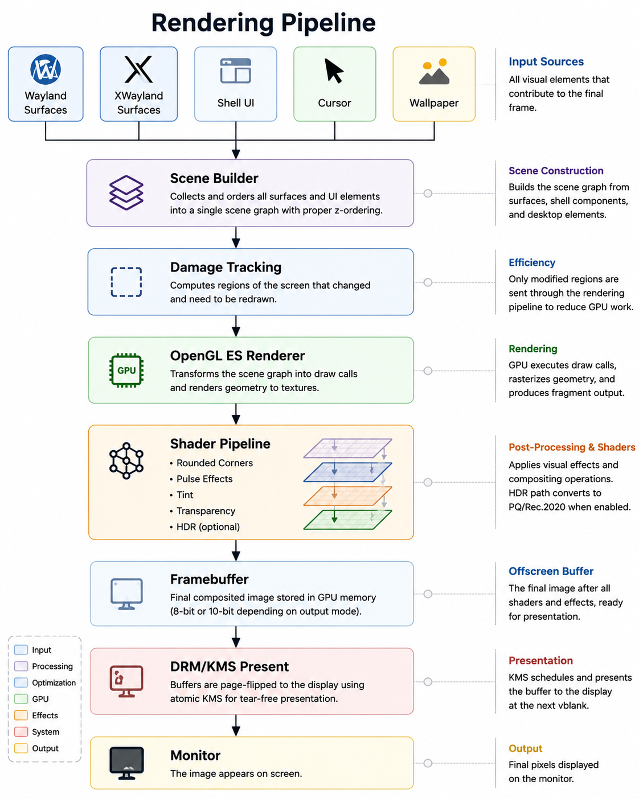
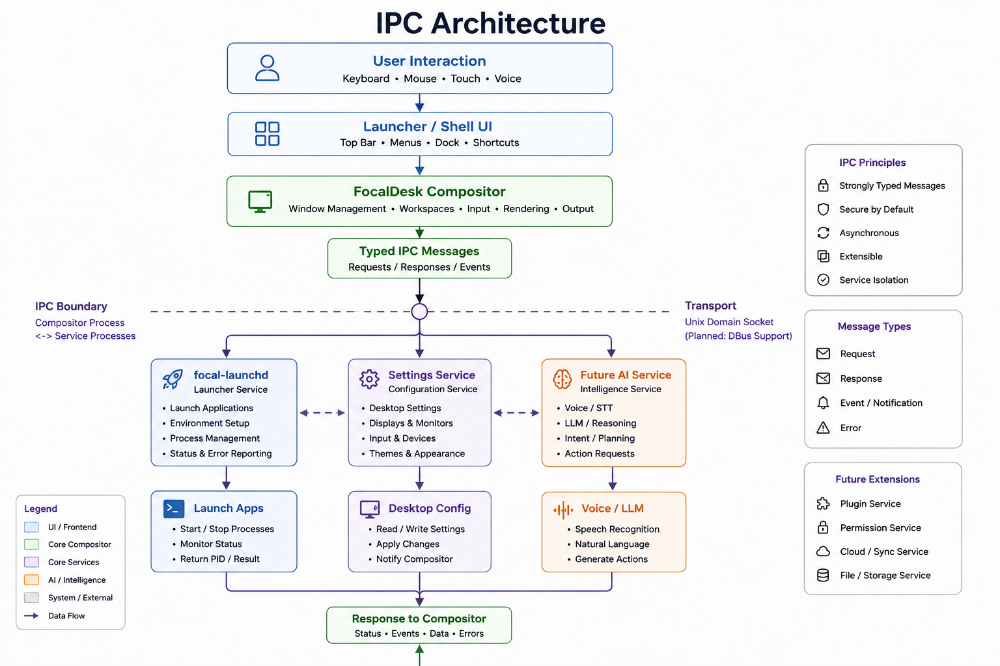

# FocalDesk Architecture

FocalDesk is a Rust-based Wayland desktop environment and compositor for Linux. It combines a custom compositor, desktop shell, launcher service, GTK companion applications, rendering effects, XWayland compatibility, PipeWire capture, and planned AI-assisted desktop workflows.

## Goals

- Build a functional Linux desktop environment around a custom Wayland compositor
- Keep the compositor focused on display, input, surfaces, rendering, and session behavior
- Move process launching and future automation into separate services
- Move shell-based Wi-Fi, Bluetooth, and volume control out of the compositor
- Support real-world applications, including GTK, X11/XWayland, Wine, browsers, OBS, and games
- Provide a modular foundation for future AI-assisted workflows
- Favor practical usability over a toy compositor demo

## High-Level Overview

The diagrams below are conceptual maps of FocalDesk rather than exact module or
process diagrams. They show which parts of the desktop own a responsibility and
the general direction in which frames and messages move. Items labeled
**Future** or **Planned** describe the intended architecture and are not yet
complete.

## System Architecture

Applications submit Wayland or XWayland surfaces to the compositor. The
compositor owns window and workspace state, input routing, shell behavior, and
output coordination. It passes the scene to the renderer, which uses the active
backend to present it on a display. Work that does not need direct access to
compositor state—such as launching applications, settings, file management, and
future AI features—lives in separate services and communicates through IPC.

## Rendering Pipeline

The rendering diagram follows one frame from its visual inputs to the monitor.
Wayland and XWayland surfaces are combined with FocalDesk shell elements, the
cursor, and wallpaper in z-order. Damage tracking limits work to changed output
regions where possible. The OpenGL ES renderer draws the scene, applies enabled
effects and color processing, and hands the completed framebuffer to DRM/KMS
for presentation.

Portal screen capture branches from the completed compositor scene before the
monitor-specific ICC, gamut, or transfer-function encode. The current
`ext-image-copy-capture-v1` transport negotiates pixel formats but carries no
color-space metadata, so FocalDesk defines its untagged portal/PipeWire contract
as SDR sRGB/Rec.709. Scene-linear wide-gamut pixels are explicitly converted to
that contract instead of copying a Display-P3 or PQ scanout buffer and allowing
consumers to misinterpret it. DMA-BUF negotiation prefers supported 10-bit RGB
formats and falls back to 8-bit RGB or SHM; direct 10-bit rendering preserves
precision through the conversion.

When HDR rendering is active, capture uses the output reference-white and peak
luminance metadata to apply a luminance-preserving shoulder into the SDR range.
Diffuse values below the knee remain unchanged, while highlights roll off to
SDR white without independently clipping RGB channels. Extended-gamut values
are then compressed toward equal-luminance Rec.709 before sRGB encoding.

Tagged wide-gamut and HDR capture require an end-to-end color-description
channel through the capture protocol, portal implementation, PipeWire format,
and consumer. Until that exists, the stable compatibility contract remains
sRGB/Rec.709. The scene-linear capture boundary is intentionally retained so a
future tagged path can preserve wide gamut or HDR without sampling
monitor-encoded pixels.

Damage tracking includes output regions and Smithay's per-surface damage
history for mapped toplevel, popup, and layer-shell trees. Synchronized
subsurface damage is translated through buffer transforms, scaling, viewporter
state, and surface placement before it reaches the output damage queue.
Detach, reparent, and destruction paths preserve and repaint old placements.
Bounding-box and full-output damage remain safe fallbacks for unsupported
commits and layer-shell rearrangements that can move sibling surfaces.

## IPC Architecture

The IPC diagram highlights the process boundary between the compositor and
desktop services. Typed requests, responses, and events cross that boundary so
a failed or slow service does not have to run inside the rendering and input
loop. The launcher service is an example of this separation. The permission
service, AI service, additional transports, and other boxes explicitly marked
as future work describe the planned direction rather than the current feature
set.
